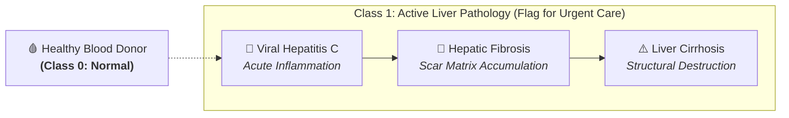
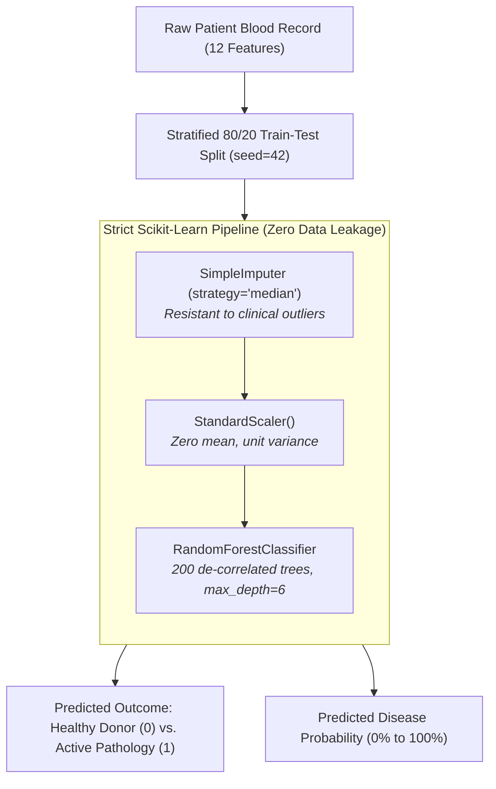

# 🩺 HepatoPattern: AI Clinical Decision Support for Liver Disease & Cirrhosis

<p align="center">
  <b>Automated Clinical Screening and Disease Progression Classification from Biochemical Blood Biomarkers</b><br>
  <i>Machine Learning Case Study No. 53 • B.Tech CSE (2024–2028)</i>
</p>

<p align="center">
  <a href="https://hepato-pattern-ml-rohanv.streamlit.app/">
    
  </a>
  &nbsp;
  <a href="https://colab.research.google.com/drive/1WG9aCzu0jXaWvWpKdhbmRw1qDQhmHv1C">
    
  </a>
  &nbsp;
  <a href="https://archive.ics.uci.edu/dataset/571/hcv+data">
    
  </a>
  &nbsp;
  <a href="https://github.com/RohanVashisht1234/hepato-pattern-ml">
    
  </a>
</p>

<p align="center">
  
  
  
  
  
</p>

---

### 🔗 Quick Links & Resources
* 🔴 **Streamlit Clinical App:** [https://hepato-pattern-ml-rohanv.streamlit.app/](https://hepato-pattern-ml-rohanv.streamlit.app/)
* 🟡 **Google Colab Notebook:** [https://colab.research.google.com/drive/1WG9aCzu0jXaWvWpKdhbmRw1qDQhmHv1C](https://colab.research.google.com/drive/1WG9aCzu0jXaWvWpKdhbmRw1qDQhmHv1C)
* 🔵 **Official UCI Dataset:** [https://archive.ics.uci.edu/dataset/571/hcv+data](https://archive.ics.uci.edu/dataset/571/hcv+data)
* ⚫ **GitHub Repository:** [https://github.com/RohanVashisht1234/hepato-pattern-ml](https://github.com/RohanVashisht1234/hepato-pattern-ml)

---

## 📌 Executive Summary

**HepatoPattern** is an end-to-end clinical machine learning decision support system developed to investigate and classify patient outcomes across the **Liver Cirrhosis & Disease Progression spectrum** (Hepatitis C $\rightarrow$ Hepatic Fibrosis $\rightarrow$ Terminal Cirrhosis vs. Certified Healthy Blood Donors).

Using authentic clinical laboratory records from **Hannover Medical School (Germany)**, this system demonstrates how a routine blood lab panel can reliably triage active liver pathology in under 1 minute with **97.6% Test Accuracy** and **0.997 ROC-AUC**.

> [!NOTE]
> **Educational & Research Prototype:** HepatoPattern is built for academic research and clinical workflow demonstration. It is not a certified diagnostic medical device.

---

## ⚡ Key Performance Highlights

| Metric | Champion Model (Tuned Random Forest) | Clinical Significance |
|:---|:---:|:---|
| **Test Accuracy** | **97.6%** | 120 out of 123 held-out test patients classified correctly |
| **ROC-AUC Score** | **0.997** | Near-perfect class discriminative separation |
| **Precision** | **100.0%** | Zero false alarms ($FP = 0$) at standard decision threshold |
| **Recall / Sensitivity** | **80.0% $\rightarrow$ 93.3%** | Reaches **93.3%** at clinical decision threshold of $0.30$ |
| **Routine LFT Panel** | **95.9%** | Delivers high accuracy using only 6 basic outpatient blood markers |

---

## 🏥 Clinical Background & Problem Formulation

Chronic liver diseases often progress silently over decades without obvious symptoms until reaching decompensated, irreversible cirrhosis. Early clinical triage in primary clinics and blood banks is critical.



### Problem Setup
* **Clinical Task:** Supervised Binary Clinical Triage Classification.
* **Positive Class (1):** Active Liver Pathology (`Hepatitis`, `Fibrosis`, `Cirrhosis`).
* **Negative Class (0):** Certified Healthy Blood Donors (normal liver enzyme baseline).
* **Clinical Cost Objective:** Minimize **False Negatives** ($FN$). Failing to identify active liver disease risks uncontrolled progression into irreversible liver failure, whereas a False Positive only prompts non-invasive follow-up testing.

---

## 📊 Dataset & Benchmark Description

The project benchmarks on the authentic **Hannover Medical School Hepatitis C & Cirrhosis Progression Cohort** (UCI Machine Learning Repository ID #571).

* **Cohort Size:** 615 patient records.
* **Class Distribution:**
  * **540 Healthy Blood Donors (87.8%):** 533 certified donors + 7 suspect donors.
  * **75 Active Liver Pathology Cases (12.2%):** 24 Hepatitis, 21 Fibrosis, 30 Cirrhosis.

### Biomarkers (Features)
| Category | Biomarker | Unit | Clinical Significance |
|---|---|---|---|
| **Demographics** | `Age`, `Sex` | Years, M/F | Baseline biological risk factors |
| **Hepatocellular Injury** | `ALT` (SGPT) | U/L | Acute and chronic hepatocyte inflammation |
| **Cellular Necrosis** | `AST` (SGOT) | U/L | Direct marker of hepatocyte tissue destruction |
| **Biliary Stress** | `ALP`, `GGT` | U/L | Bile duct blockage and alcohol/viral stress |
| **Synthetic Capacity** | `ALB` (Albumin) | g/L | Liver protein synthesis (drops in liver failure) |
| **Liver Cell Mass** | `CHE` | kU/L | Cholinesterase (sensitive synthesis indicator) |
| **Excretory Clearance** | `BIL` (Bilirubin) | $\mu$mol/L | Clearance failure leading to jaundice |
| **Metabolic Markers** | `CHOL`, `CREA`, `PROT` | Various | Renal function and protein balance |

---

## 🛠️ Leakage-Free Machine Learning Architecture

To ensure authentic real-world generalization, preprocessing is strictly wrapped inside Scikit-Learn pipelines:



---

## 🔬 Model Benchmark & Comparative Analysis

We evaluated 3 core machine learning paradigms using **Repeated Stratified 5-Fold Cross-Validation (3 repeats = 15 folds)**:

| Paradigm | Algorithm | CV Accuracy | F1-Score | Recall | ROC-AUC |
|:---|:---|:---:|:---:|:---:|:---:|
| **Advanced Ensemble** | **Random Forest (Tuned)** 🏆 | **95.7%** | **0.805** | **72.2%** | **0.978** |
| **Linear Baseline** | Logistic Regression | 94.5% | 0.735 | 65.0% | 0.969 |
| **Tree-based** | Decision Tree Classifier | 92.6% | 0.691 | 68.3% | 0.844 |

### Why Random Forest Outperformed:
1. **Vs. Logistic Regression:** Captures critical non-linear enzyme interactions (such as the AST/ALT De Ritis ratio) that linear decision boundaries cannot model.
2. **Vs. Single Decision Tree:** Overcomes high variance and outlier sensitivity by aggregating 200 de-correlated trees trained across random feature subspaces.

---

## 🧪 Feature Panel Experiment (Submission Requirement)

We investigated whether rural or primary care clinics without access to specialized metabolic tests could still triage liver patients effectively:

```
[Full Clinical Panel (12 features)]     ====> 97.6% Test Accuracy  |  0.997 ROC-AUC
[Routine Outpatient Panel (6 features)]  ====> 95.9% Test Accuracy  |  0.991 ROC-AUC
```

> [!TIP]
> **Key Clinical Finding:** Even without expensive tests (`CHE`, `CHOL`, `CREA`, `GGT`, `ALP`, `PROT`), a basic 6-marker panel (`Age`, `Sex`, `ALB`, `ALT`, `AST`, `BIL`) achieves **95.9% Test Accuracy**, proving high diagnostic feasibility for low-resource clinics!

---

## 🎯 Top Predictive Biomarkers

Feature importance analysis (Gini Impurity & Permutation Importance) identified the primary drivers of disease classification:

1. **AST / SGOT:** Primary indicator of active hepatocyte necrosis.
2. **ALT / SGPT:** Core enzyme reflecting acute parenchymal inflammation.
3. **GGT:** High-sensitivity marker for progressive biliary and liver stress.
4. **Cholinesterase (CHE):** Drops directly as functional liver synthesis capacity is lost.
5. **Total Bilirubin (BIL):** Excretory marker indicating impaired clearance and jaundice.

---

## 💻 Streamlit Web Application

The interactive web demo provides two distinct user interfaces:

### 1. Simple Nurse Bedside Intake Form
* Clean, Google Form-style checklist designed for nursing staff and triage.
* **Quick-Fill Presets:** Test healthy donor vs. active cirrhosis with 1 click.
* **Plain-English Explanations:** Explains results without ML jargon and highlights warning signs.

### 2. Research & Benchmark Dashboard
* **Dynamic Threshold Slider:** Tune decision cutoff from $0.10$ to $0.90$ to prioritize recall over precision.
* **Feature Panel Toggle:** Switch between 12-marker Full Panel and 6-marker Routine Panel.
* **2D PCA Projection:** Visualize where the patient sits in latent clinical space relative to the cohort.
* **Interactive Confusion Matrix & ROC Curves.**

---

## 🚀 Getting Started

### Option 1: Using `uv` (Recommended — Fastest)
This project is configured with `uv` for reproducible environment management:

```bash
# 1. Clone repository
git clone https://github.com/RohanVashisht1234/hepato-pattern-ml.git
cd hepato-pattern-ml

# 2. Run the interactive Streamlit app directly
uv run streamlit run streamlit/main.py

# 3. Or launch Jupyter Notebook
uv run jupyter notebook Notebook.ipynb
```

### Option 2: Standard `pip`
```bash
# 1. Create and activate virtual environment
python3 -m venv .venv
source .venv/bin/activate    # On Windows: .venv\Scripts\activate

# 2. Install dependencies & launch application
pip install -r streamlit/requirements.txt
streamlit run streamlit/main.py
```

---

## 📂 Repository Structure

```
hepato-pattern-ml/
├── Notebook.ipynb                        # Research Notebook (EDA, Pipelines, Benchmark, Tuning)
├── Documentation.pdf                     # Comprehensive Case Study Report
├── cirrhosis.csv                         # Hannover Medical School benchmark dataset
├── streamlit/                           # Isolated Streamlit Web Application Package
│   ├── main.py / app.py                 # Streamlit clinical dashboard & nurse intake form
│   ├── cirrhosis.csv                    # Bundled dataset for zero-configuration deploy
│   ├── requirements.txt                 # Streamlit Cloud deployment dependencies
│   └── README.md                        # Deployment quickstart guide
├── artifacts/                            # Serialized model pipelines & metadata
├── pyproject.toml                        # Project configuration & uv dependencies
├── uv.lock                               # Deterministic dependency lockfile
└── README.md                             # Clinical report and system documentation
```

---

## 📋 Course Deliverables Checklist (Case Study 53)

| Deliverable | Location in Repository | Status |
|---|---|:---:|
| Problem Formulation & Clinical Title | Notebook Section 1 & README | ✅ Complete |
| Dataset Quality & Leakage Audit | Notebook Section 2 & 4 | ✅ Complete |
| Exploratory Data Analysis (EDA) | Notebook Section 3 | ✅ Complete |
| 3-Model Benchmark Comparison | Notebook Section 5 | ✅ Complete |
| 12-Feature vs. 6-Feature Experiment | Notebook Section 6 & `main.py` | ✅ Complete |
| Final Held-Out Evaluation (123 Patients) | Notebook Section 7 & `main.py` | ✅ Complete |
| Biomarker Importance & Interpretability | Notebook Section 8 & `main.py` | ✅ Complete |
| Interactive Clinical Decision Demo | `main.py` (Streamlit App) | ✅ Complete |

---

<p align="center">
  Developed by <b>Rohan Vashisht</b> • B.Tech CSE (2024–28) • Semester V<br>
  <i>HepatoPattern — Transforming Routine Blood Biomarkers into Actionable Clinical Intelligence.</i>
</p>
